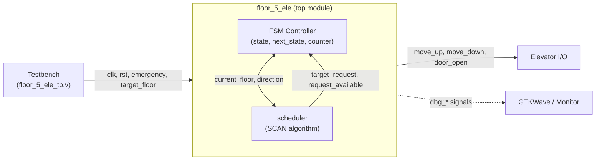
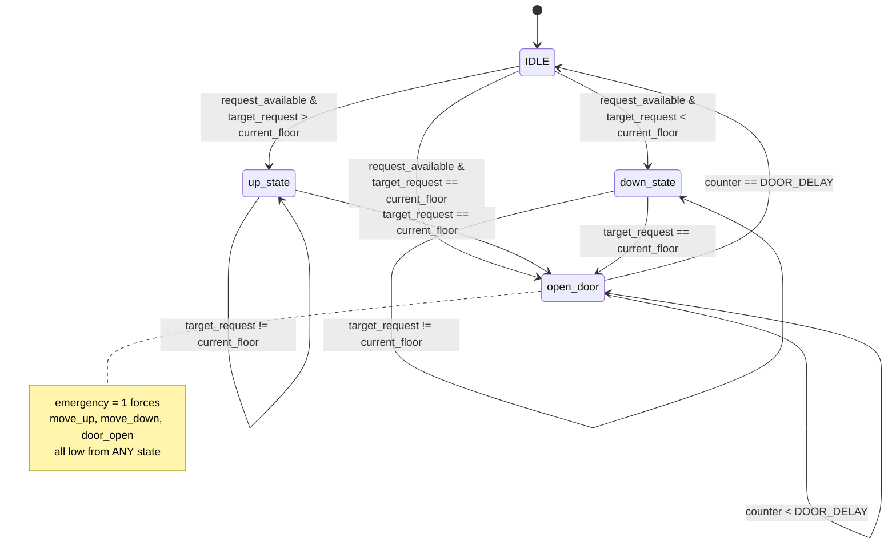

# SCAN Elevator Controller (Verilog)

A synthesizable RTL elevator controller for a 5-floor building, implemented as a
Mealy/Moore-style FSM with a **SCAN-algorithm scheduler** (the same disk-scheduling
strategy used in OS I/O schedulers, applied to floor requests). Written and verified
in Verilog with a self-checking Icarus Verilog testbench and GTKWave waveform output.

## Architecture



The `scheduler` module is purely combinational — it re-evaluates the best
target floor every cycle based on `pending_request` and `direction`. The FSM
is the only sequential part that actually moves the elevator.

## FSM state diagram



## Waveform preview

Captured from an actual simulation run (Test 1: ground floor → requests for
floors 4, 2, and 3 arrive while already moving — SCAN reorders them to
service floor 2 first, then 3, then 4):


## Features

- **5-floor FSM controller** (`IDLE`, `MOVING_UP`, `MOVING_DOWN`, `DOOR_OPEN` states)
  with parameterizable floor count (`NUM_FLOOR`) and auto-computed address width
  (`FLOOR_WIDTH = $clog2(NUM_FLOOR)`).
- **SCAN-algorithm scheduler**: services pending floor requests in the current
  direction of travel first, then reverses — avoiding unnecessary back-and-forth
  movement, just like a real elevator dispatch system.
- **Configurable timing**: move-per-floor delay and door-dwell delay are both
  parameters, decoupled from the FSM logic.
- **Emergency stop**: an `emergency` input immediately forces all outputs
  (`move_up`, `move_down`, `door_open`) low and freezes elevator motion, resuming
  cleanly once cleared.
- **Bounds-safe floor requests**: any `target_floor` value outside the valid
  range (an artifact of binary-encoding a non-power-of-2 floor count) is
  ignored by the RTL and rejected at the testbench level too.
- **Debug/observability ports** (`dbg_state`, `dbg_current_floor`,
  `dbg_pending_request`, `dbg_target_request`, `dbg_direction`,
  `dbg_request_available`) for easy waveform inspection without needing to
  probe internal signals.
- **Self-checking testbench** with pass/fail assertions covering:
  - Reset behavior
  - Single-floor up/down moves
  - Same-floor request handling
  - Multi-request SCAN ordering (including mid-travel direction reversal)
  - Top/bottom floor boundary conditions
  - Emergency stop mid-travel and while doors are open
  - Race condition: new request arriving the same cycle an old one is cleared
  - Exhaustive invalid floor-code rejection
- **Timing-efficient test schedule**: wait times are computed from the DUT's
  own `MOVE_DELAY`/`DOOR_DELAY`/clock parameters rather than guessed constants,
  keeping simulation runs short and easy to read in the waveform.
- **GTKWave-ready**: `$dumpfile`/`$dumpvars` produce a `.vcd` trace for full
  visual waveform debugging.

## How it works — the important registers

If you're reading the RTL for the first time, these are the registers that
actually drive the elevator's behavior. Everything else is largely glue
around these five.

### 🔹 `state` / `next_state` — where the elevator "is" right now
A 2-bit register holding one of four states:
- **`IDLE`** — parked, waiting for a request
- **`up_state`** — actively moving up
- **`down_state`** — actively moving down
- **`open_door`** — stopped at a floor with the doors open

`state` is what gets registered on the clock edge; `next_state` is the
combinational logic that decides where to go next. Think of `state` as **what
the elevator is doing this cycle** and `next_state` as **what it's about to do
next cycle**.

### 🔹 `current_floor` — the elevator's physical position
This is the ground truth for where the car actually is. It only changes in
`up_state`/`down_state`, and only after the movement delay counter finishes
counting — it never jumps floors. Guard conditions prevent it from going
below floor 0 or above `NUM_FLOOR-1`, so it can't run off the ends of the
shaft even if something upstream misbehaves.

### 🔹 `pending_request` — the "call buttons that are lit up"
A one-bit-per-floor vector (`NUM_FLOOR` bits wide). Bit `i` is `1` if floor
`i` has an outstanding request. This is the elevator's memory of who's
waiting — it's set when someone requests a floor and cleared once that floor
has been serviced (door has stayed open for the full `DOOR_DELAY`). The
scheduler reads this vector every cycle to decide where to go next.

### 🔹 `direction` — which way the elevator was last headed
A single bit (**`0`** = last moving up, **`1`** = last moving down) that persists
across trips. This is what makes it a **SCAN scheduler** instead of a
first-come-first-served one: the scheduler always finishes sweeping in its
current direction before reversing, exactly like a real elevator doesn't
double back for every single button press.

### 🔹 `counter` — the internal stopwatch
A small counter used for two unrelated timing jobs depending on the state:
- In `up_state`/`down_state`, it counts up to `MOVE_DELAY` before letting
  `current_floor` actually change — this is what makes floor travel take
  multiple clock cycles instead of teleporting.
- In `open_door`, it counts up to `DOOR_DELAY` before the doors are allowed
  to close and the FSM returns to `IDLE` — this is the "doors stay open for
  a few seconds" behavior.

### 🔹 `target_request` / `request_available` (from the scheduler module)
Not registers in the top module, but worth knowing: these are the
scheduler's answers to **"where should we go next?"** and **"is there anywhere to
go at all?"**. The FSM's `next_state` logic leans entirely on these two wires
to decide whether to start moving, keep moving, or open the doors.

> **Putting it together:** every clock cycle, the scheduler looks at
> `pending_request` and `direction` to pick a `target_request`. The FSM
> compares that to `current_floor` to decide its `next_state`. Once moving,
> `counter` paces how fast `current_floor` changes. When a floor is reached,
> `open_door` holds for `DOOR_DELAY` cycles, clears that floor's
> `pending_request` bit, and the cycle repeats.

## Repository structure

```
.
├── floor_5_ele.v            # DUT: elevator FSM + SCAN scheduler
├── floor_5_ele_tb.v         # Self-checking testbench
├── dump.vcd                 # GTKWave waveform (generated by simulation)
├── images/
│   └── waveform_preview.png # Rendered waveform snapshot used in this README
└── README.md
```

## Requirements

- [Icarus Verilog](http://iverilog.icarus.com/) (`iverilog`, `vvp`)
- [GTKWave](http://gtkwave.sourceforge.net/) for waveform viewing

## Running the simulation

```bash
iverilog -g2012 -o sim.out floor_5_ele.v floor_5_ele_tb.v
vvp sim.out
```

This prints a live `$monitor` trace of every state transition and generates
`dump.vcd`.

## Viewing waveforms

```bash
gtkwave dump.vcd
```

Recommended signals to add to the viewer: `dbg_state`, `dbg_current_floor`,
`dbg_pending_request`, `dbg_target_request`, `dbg_direction`, `move_up`,
`move_down`, `door_open`, `emergency`, `target_floor`.

## Known limitations

- `target_floor` is level-sensitive in the current RTL: if a request is held
  at the same value as the current floor, the door will repeatedly reopen
  instead of settling in `IDLE`. This mirrors how a *held* button input would
  behave with the current logic; real button inputs are expected to be
  pulsed/debounced externally. Edge-sensitive request latching is a natural
  next improvement.

## License

Add your preferred license (MIT is a common choice for hobby/academic RTL
projects) as `LICENSE` in the repo root.
